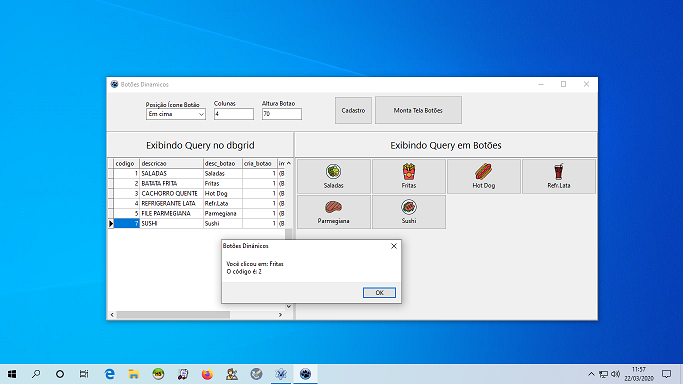

# Lazarus - GridBotoes
## PROGRAMA: BOTÕES DINAMICOS

# IDE LAZARUS (Pascal)

### Autor com paineis: HUMBERTO SALES (https://www.youtube.com/user/salesdoido)
### Adaptação troca de paineis por botões vinculado a uma consulta SQL: DANIEL DE MORAIS (https://www.youtube.com/user/infocotidiano/)

O Humberto fez no seu canal (https://youtu.be/yX5Y9ytp5K0) um exemplo de como trabalhar com panels, utilizando imagens e mudando a cor do panel. 
Eu precisava criar um PDV (Ponto de Venda) para restaurantes e queria mostrar na tela botões com imagens, vindo de um cadastro de categorias e produtos. 
Então resolvi adaptar o programa que o Humberto fez para atender minhas necessidades e trabalhar com SQL, Imagens e Botões. 
Dentro da pasta banco de dados, existe o SQL para você criar seu banco e utilizar os registros prontos. 

### Link para o meu video: (https://youtu.be/AxQcr4GyfyI)
